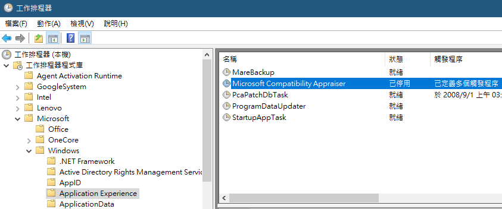

# 內建管理工具

## 工作排程器 (Task Scheduler)

```
Win+R => taskschd.msc
```

## 停用 Microsoft Compatibility Telemetry

Task Scheduler Library → Microsoft → Windows → Application Experience → Microsoft Compatibility Appraiser


